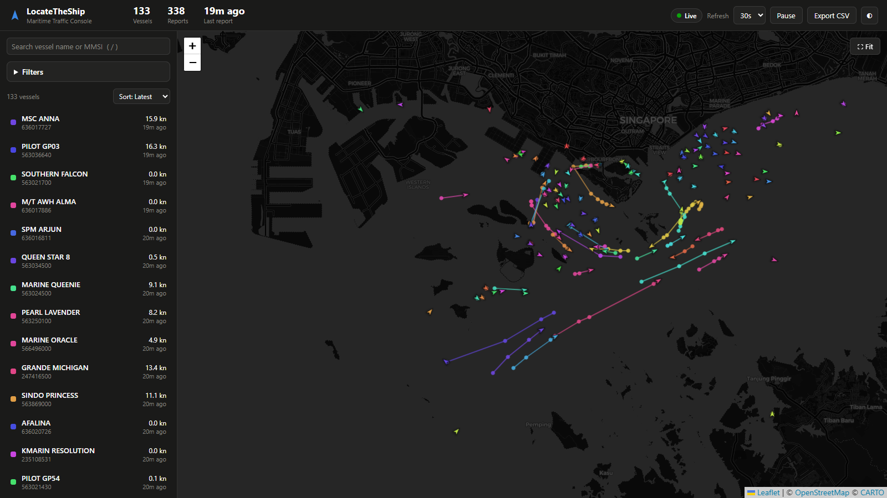
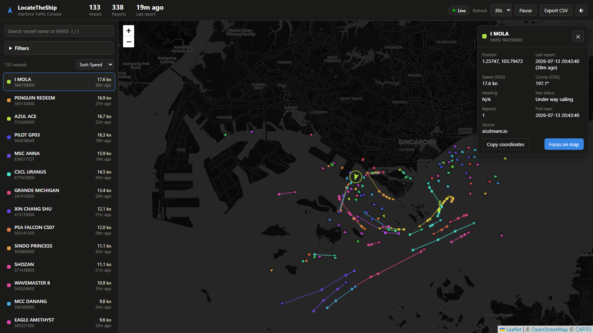
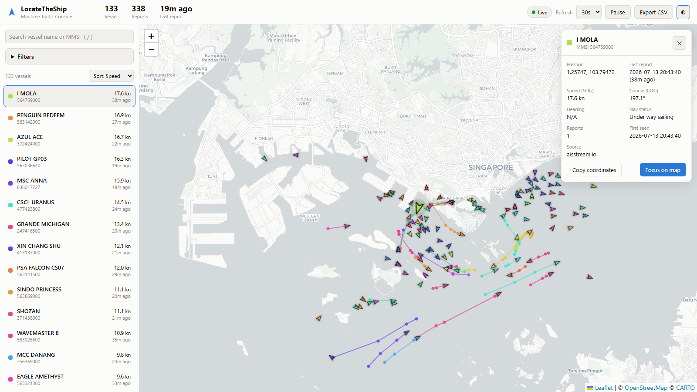

# Aisstream

## Description

A self contained AIS vessel tracking stack. A producer streams live ship position reports from aisstream.io into Kafka, ksqlDB joins the position and ship name streams, a JDBC sink connector writes the joined stream into PostgreSQL, and a Flask backend serves an analyst console that plots the ships on a live map with per ship tracks, speed, course, heading and navigational status.

The entire pipeline configures itself. A one shot `pipeline-init` container creates the ksqlDB streams and the sink connector automatically, so there is no manual Control Center or CloudBeaver setup anymore.

### Architecture

aisstream.io websocket feeds the `ais-producer` service, which publishes Avro records to the Kafka topics `aisstream1` (position and motion data) and `aisstream2` (ship names). The `pipeline-init` service creates ksqlDB streams over both topics plus a joined `aisstream_combined` stream, then registers a JDBC sink connector that writes the joined stream into the `aisstream_combined` table in PostgreSQL. The `ais-website` service exposes a small JSON API over that table (`/api/vessels`, `/api/export.csv`, `/healthz`) and serves the analyst console at port 5000. The console is a single page Leaflet application with no build step.

### Files and folders

The `producer` folder holds the code that streams aisstream.io data into Kafka. The `pipeline-init` folder holds the bootstrap script that creates the ksqlDB streams and the sink connector. The `application` folder holds the Flask backend (JSON API) and the console frontend (`templates/console.html`, `static/js/console.js`, `static/css/console.css`). The `consumer` folder holds a small standalone script for debugging Kafka topics from the command line. `docker-compose.yml` wires everything together.

## Requirements

Docker Desktop is the only requirement. Python is only needed if you want to run the scripts outside of Docker.

## Usage

```
docker compose up -d --build
```

Then open http://localhost:5000. On a cold start the pipeline needs a minute or two before the first ships appear because Kafka, ksqlDB and Connect have to come up and the bootstrap has to run. The console shows a warming up state and keeps polling until data arrives.

To use your own aisstream.io API key, copy `.env.example` to `.env` and set `AISSTREAM_API_KEY`. Without it a built in demo key is used. The tracked area is defined by the bounding box in the `SUBSCRIPTION_JSON` block of `docker-compose.yml` and currently covers the waters around Singapore and the Malacca Strait.

### The analyst console



The console updates in place from the JSON API on a configurable interval (10, 30 or 60 seconds, pausable), so the picture stays live without page reloads. The header shows vessel and report counts, the age of the newest report and a connection status pill. Each vessel's latest position renders as a small directional arrow rotated to its true heading (or course over ground when no heading is reported), colored deterministically per vessel so tracks keep their color across refreshes. Older reports draw as dots along the track line.

The sidebar lists every vessel in the current view with speed and report age, sortable by recency, name, speed or report count, and instantly filterable by typing a name or MMSI (press the slash key to jump to search). Clicking a vessel in the list or on the map opens a detail panel with position, timestamps, speed over ground, course, heading, navigational status decoded to plain language, data source and report counts, plus a copy coordinates shortcut for pasting into other tools.



Server side filters accept comma separated ship names (with % wildcards) and MMSIs, a data source selector and a time range with quick presets for the last 15 minutes, hour, 6 hours or 24 hours. Filters are reflected in the URL so a filtered view can be bookmarked or shared. The Export CSV button downloads exactly the filtered data for offline analysis. A light theme is available for bright environments and both themes swap the map tiles to match.



### Optional tooling

Confluent Control Center, CloudBeaver and the ksqlDB CLI are no longer needed for setup, so they are behind a compose profile to keep the default stack light. Start them when you want them with

```
docker compose --profile tools up -d
```

Control Center is then at http://localhost:9021 and CloudBeaver at http://localhost:8978.

### Upgrading from an older version

The pipeline now carries additional fields (speed, course, heading, navigational status and source), which changes the Kafka schemas and the database table. When upgrading an existing deployment, reset the stored state once with

```
docker compose down -v
docker compose up -d --build
```

### Stop the containers

```
docker compose down
```

## Contributing

Contributions to the Aisstream project are welcomed. If you plan to make significant changes, please open an issue first to discuss the proposed modifications. Additionally, ensure that you update the relevant tests to maintain code integrity.

## Authors

The Aisstream application is maintained by cadzchua.

## License

This project is licensed under the [MIT](LICENSE). You are free to use, modify, and distribute the software as per the terms of the license agreement.
